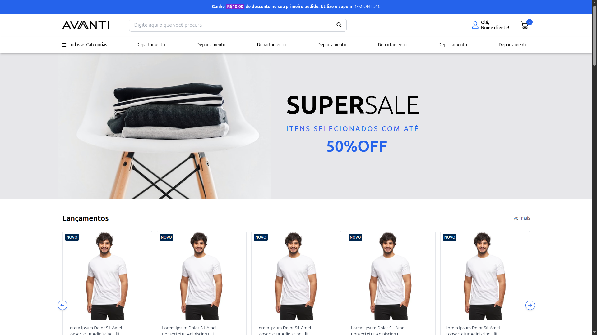
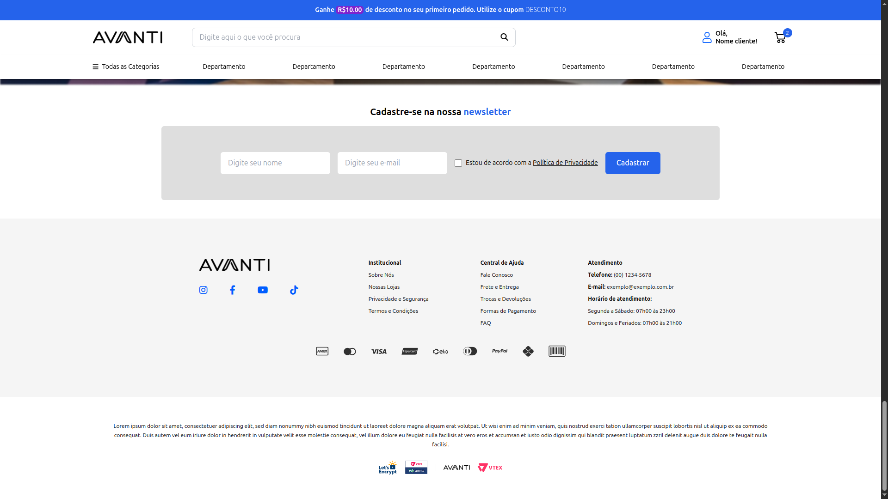
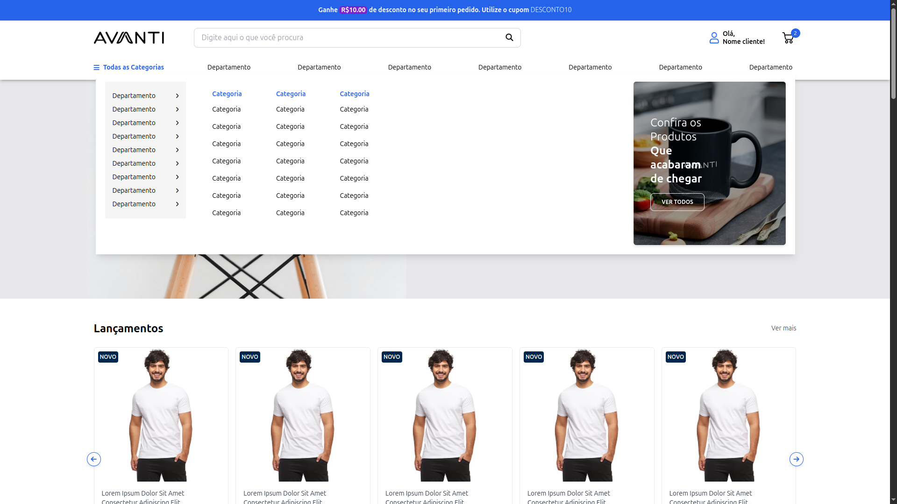
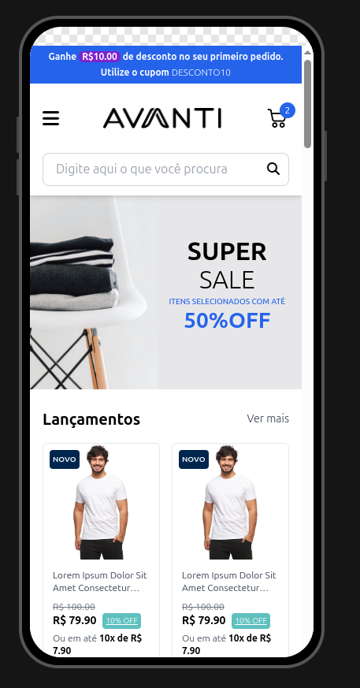
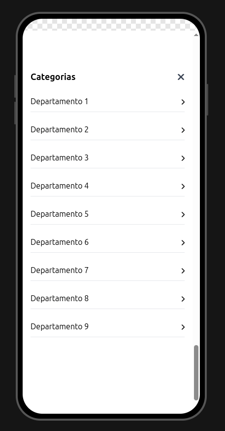

# 🛍️ Avanti - Loja Online

Este projeto foi desenvolvido como parte do **primeiro desafio do processo seletivo da Avanti**. Ele consiste em uma página web responsiva que simula uma loja online.

---

## 🌐 Deploy

O projeto está disponível online, você pode acessá-lo através do link abaixo:

<a href="https://avanti-one.vercel.app/" target="_blank">🔗 Clique aqui para acessar o deploy</a>

---

## 📋 Funcionalidades

- ✅ **Carrossel animado** para desktop com transições suaves.
- ✅ **Carrossel touch screen** exclusivo para dispositivos móveis.
- ✅ **Pesquisa com resposta de texto dinâmica** via campo de input na navbar.
- ✅ **Menu com hover interativo** em telas desktop.
- ✅ **Layout responsivo** com adaptação total entre mobile e desktop.

---

## 🛠️ Tecnologias Utilizadas

- **HTML5**: Estrutura semântica da página.
- **Tailwind CSS**: Estilização responsiva e moderna.
- **JavaScript (ES6)**: Funcionalidades interativas, como carrossel e menu responsivo.
- **Swiper.js**: Biblioteca para criação de carrosséis.
- **Font Awesome**: Ícones para navegação e interação.

---

## 📸 Capturas de Tela

### 🖥️ Versão Desktop
  
  


### 📱 Versão Mobile
<div align="center">
  
  
  
</div>

---

## 📦 Como Clonar o Repositório

```bash
git clone https://github.com/gbmacena/avanti.git
```
---

## 👨‍💻 Autor

Desenvolvido por **Gabriel Macena**  
Feito com ❤️ para o processo seletivo da **Avanti**.

<a href="https://www.linkedin.com/in/gabriel-macena-871333315/" target="_blank">🔗 LinkedIn</a>


